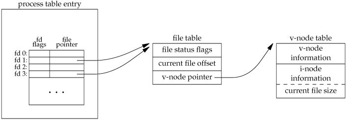
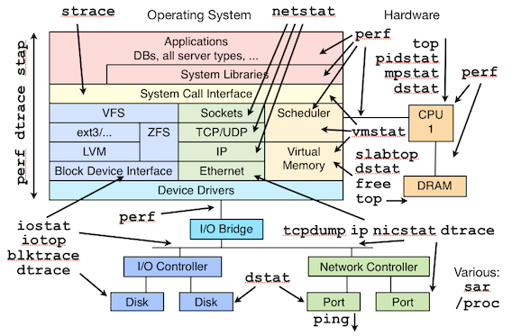
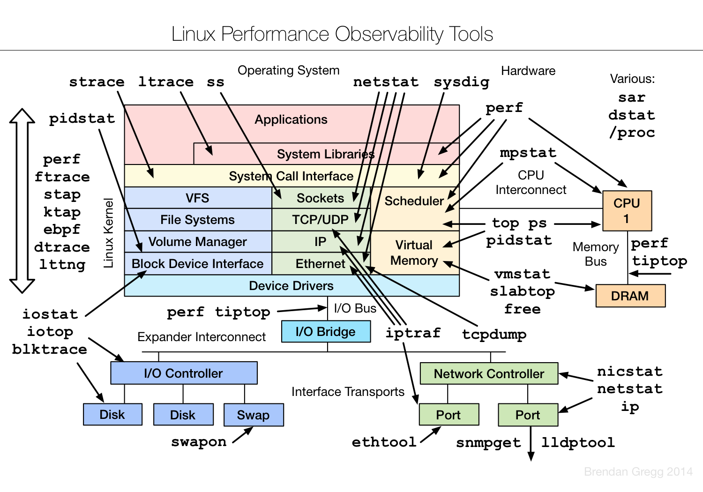

# Linux

## 文件系统

* 软硬连接


* dup和dup2


* 文件描述符



* 除斜线`/`和空字符（ASCII字符`\0`）以外，文件名可以包含任意的ASCII字符，因为那两个字符被核心当做表示路径名的特殊字符来解释。

* 默认最大打开文件数限制。在/etc/security/limits.conf里增加下面内容
```
* soft nofile 64000
* hard nofile 64000
```

## 网络

* 在linux下写socket的程序的时候，如果尝试send到一个disconnected socket上，就会让底层抛出一个SIGPIPE信号。<br>
  这个信号的缺省处理方法是退出进程，大多数时候这都不是我们期望的。<br>
  因此我们需要重载这个信号的处理方法。调用以下代码，即可安全的屏蔽SIGPIPE：
```c
struct sigaction sig;

memset(&sig, 0, sizeof(struct sigaction));

sig.sa_handler = SIG_IGN;
sig.sa_flags = 0;
sigemptyset(&sig.sa_mask);
sigaction(SIGPIPE, &sig, NULL);
```

## 常用工具原理






## 生成coredump

- 在终端中输入`ulimit -c` 如果结果为0，说明当程序崩溃时，系统并不能生成core dump。

- 使用`ulimit -c unlimited`命令，开启core dump功能，并且不限制生成core dump文件的大小。如果需要限制，加数字限制即可。`ulimit - c 1024`

- 默认情况下，core dump生成的文件名为core，而且就在程序当前目录下。新的core会覆盖已存在的core。通过修改/proc/sys/kernel/core_uses_pid文件，可以将进程的pid作为作为扩展名，生成的core文件格式为core.xxx，其中xxx即为pid

- 通过修改/proc/sys/kernel/core_pattern可以控制core文件保存位置和文件格式。例如：将所有的core文件生成到/corefile目录下，文件名的格式为core-命令名-pid-时间戳. echo "/corefile/core-%e-%p-%t" > /proc/sys/kernel/core_pattern
