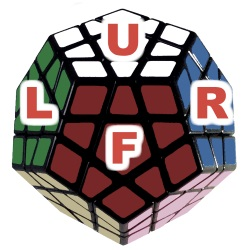
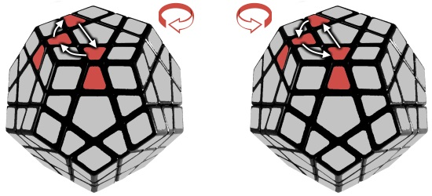
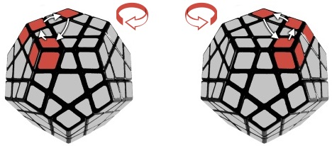
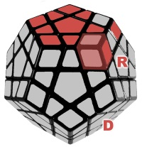

# 五魔方

https://ruwix.com/twisty-puzzles/megaminx-gigaminx-teraminx-petaminx/

## 最后一层棱块位置

图案   | 公式
---    | ---
顺时针 | R U R' U R U3 R' U
逆时针 | U' R U2 R' U' R U' R'

## 最后一层角块位置

图案   | 公式
---    | ---
顺时针 | L' U2 R U'2 - L U2 R' U'2
逆时针 | R U'2 L' U2 - R' U'2 L U2

## 最后一层角块方向

`(R' D' R D) * 2`或`(R' D' R D) * 4`调整URF位置的角块方向
