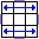
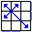
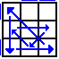

# PLL

 图案                                         | 公式
----                                          | ----
1     | M'2 U M U2 M'U M'2
2     | M'2 U' M U2 M' U' M'2
3     | M2 U M2 U2 M2 U M2
4     | M' U (M'2 U)2 M' U2 M'2 U'
5     | x' R2 D2 (R' U' R) D2 (R' U R')
6     | x' (R U' R) D2 (R' U R) D2 R'2
7     | (R2 U R' U') y (R U R' U')2 (R U R') y' (R U' R2)
8     | (R U R' U') (R' F) (R2 U' R' U') (R U R' F')
9     | (R' U R U') (R2' F' U') (F U R U') x' (R2 U' R' U)
10    | (R' U R' d') (R' F' R2 U') (R' U R' F R F)
11    | F (R U' R' U') (R U R' F') (R U R' U') (R' F R F')
12    | x U2 (r' U' r U2) (l' U R' U' R2)
13    | (R U R' F') (R U R' U') (R' F R2 U' R' U')
14    | (R' U2) (R U' U') (R' F R U R' U') (R' F' R2 U')
15    | (R U' U') (R' U2) (R B' R' U') (R U R B R2' U)
16    | (R2' u' R U' R) (U R' u) (R2 f R' f')
17    | (R U R') y' (R2' u' R U') (R' U R' u R2)
18    | (R2 u) (R' U R' U') (R u') (R2' F' U F)
19    | (R' d' F) (R2 u) (R' U) (R U' R u' R2)
20    | (R U R' U) (R U R' F') (R U R' U') (R' F) (R2 U' R' U2) (R U' R)
21    | (R' U R U') (R' F' U') (F R U R' F) (R' F' R U' R)
