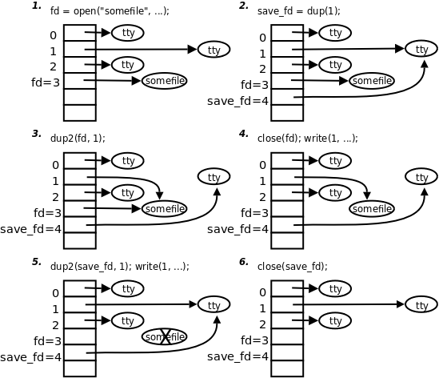
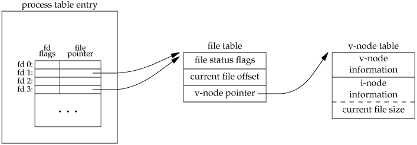
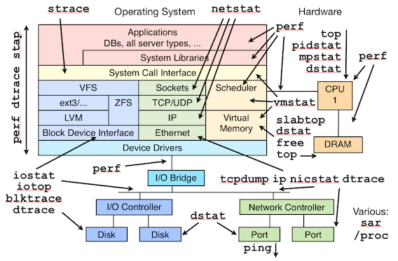
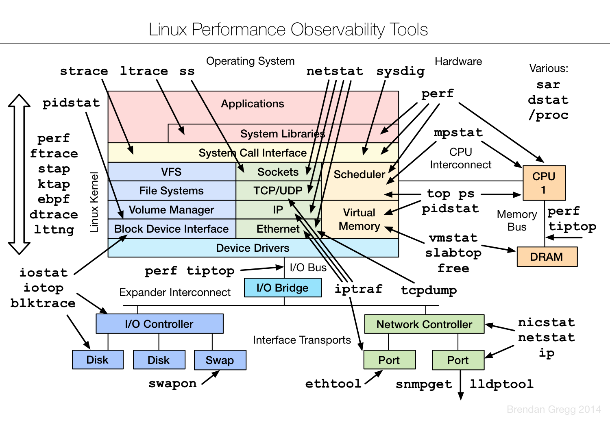
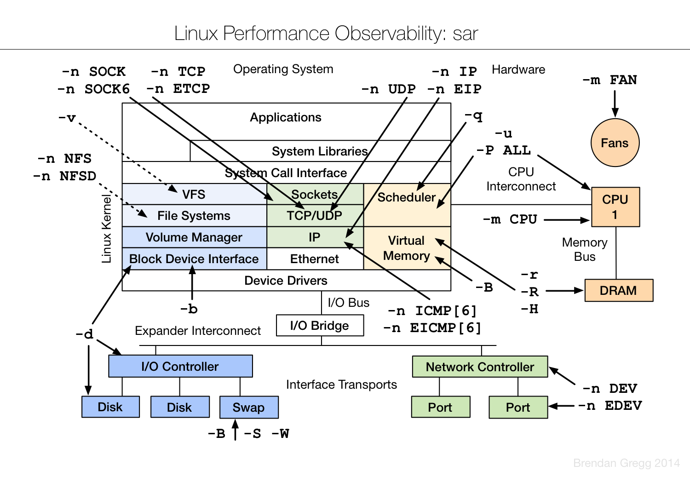
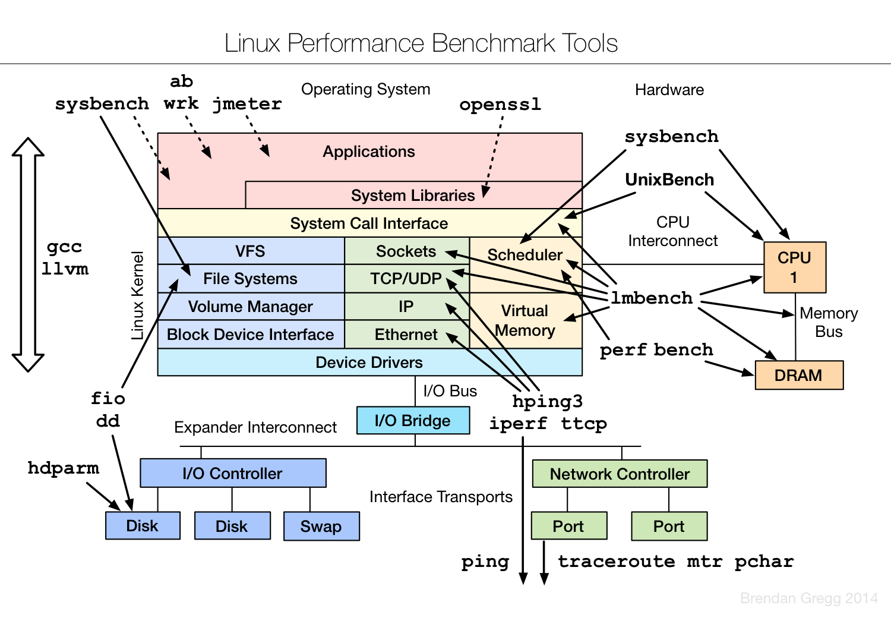

# Linux

* 软硬连接


* dup和dup2



* 文件描述符



* 除斜线（/）和空字符（ASCII字符\0）以外，文件名可以包含任意的ASCII字符，因为那两个字符被核心当做表示路径名的特殊字符来解释。

* 在linux下写socket的程序的时候，如果尝试send到一个disconnected socket上，就会让底层抛出一个SIGPIPE信号。<br>
  这个信号的缺省处理方法是退出进程，大多数时候这都不是我们期望的。<br>
  因此我们需要重载这个信号的处理方法。调用以下代码，即可安全的屏蔽SIGPIPE：
```c
struct sigaction sig;

memset(&sig, 0, sizeof(struct sigaction));

sig.sa_handler = SIG_IGN;
sig.sa_flags = 0;
sigemptyset(&sig.sa_mask);
sigaction(SIGPIPE, &sig, NULL);
```

* linux常用工具










* Ceph

* 默认最大打开文件数限制。在/etc/security/limits.conf里增加下面内容

```
* soft nofile 64000
* hard nofile 64000
```
